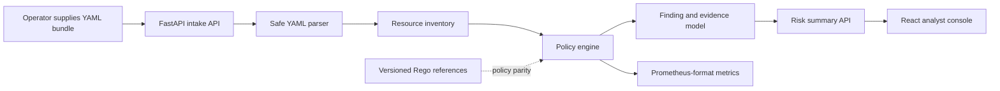

# KubeSentry Architecture

## Purpose and safety boundary

KubeSentry is a **defensive, evidence-oriented Kubernetes manifest review tool**. It evaluates YAML resources that an operator has deliberately supplied to the application, such as a checked-out repository, a CI artifact, or the included synthetic fixtures. The default build does not discover clusters, execute `kubectl`, create workloads, change resources, or persist credentials. It produces advisory findings only; remediation remains a human decision.

The local demonstration operates exclusively on the synthetic files under `fixtures/`. Any future live-cluster connector must be separately enabled, require explicit target approval, use least-privilege read-only credentials, and preserve an audit record. Those capabilities are intentionally outside this portfolio release.

## System design



The backend maintains one pure, deterministic evaluation path. The API stores only the parsed scan report in memory for the local demo, while the engine returns stable finding identifiers, resource references, JSON-pointer-style evidence paths, severity, rationale, and remediation guidance. This allows tests and the React console to share a single evidence contract.

## Components

| Component | Responsibility | Security posture |
|---|---|---|
| **Intake API** | Receives a YAML bundle or named fixture and validates size and document count. | No remote URL fetching, command execution, or cluster credentials. |
| **Manifest parser** | Splits multi-document YAML and inventories Kubernetes object metadata. | Uses `yaml.safe_load_all`; invalid documents return validation errors. |
| **Policy engine** | Evaluates deterministic workload, image, resource, service-account, and network-isolation checks. | Pure functions; no side effects or external network calls. |
| **Evidence model** | Groups findings into a reviewable report with reference identifiers. | Evidence contains manifest metadata and paths, never environment secrets. |
| **React console** | Presents posture summary, findings, resources, and remediation text. | Browser only communicates with same-origin API endpoints. |
| **Metrics endpoint** | Exposes scan and finding counters in Prometheus text format. | No labels contain operator-supplied manifest bodies. |

## Policy approach

KubeSentry implements a focused subset of workload-hardening and network-isolation checks aligned with Kubernetes Pod Security concepts. The versioned Rego files in `policies/` express representative policy-as-code logic and provide a migration path to OPA or Gatekeeper. The portfolio service uses a built-in evaluator so the demo remains deterministic without downloading an OPA binary at runtime.

The engine is designed around an adapter boundary: `evaluate_manifest_bundle(documents, policy_profile)` accepts normalized resource dictionaries and returns typed findings. A future `OpaEvaluator` can evaluate the same normalized input against the included Rego bundle without changing the API or dashboard contract.

## Data contract

```text
ScanReport
├── scan_id, generated_at, profile
├── resources[]: api_version, kind, namespace, name
├── findings[]: policy_id, severity, resource, evidence_path, rationale, remediation
└── summary: score, severity_counts, resource_count, policy_coverage
```

The risk score is a transparent posture indicator for triage, not a vulnerability score. It is calculated from documented severity weights, capped at 100, and must not be treated as proof that a deployment is secure or insecure.

## References

Kubernetes describes the Restricted Pod Security Standard as a hardening-focused profile, including restrictions on privilege escalation, non-root execution, seccomp, and Linux capabilities. [1] Kubernetes also notes that NetworkPolicy behavior depends on an enforcing network plugin and that ingress and egress isolation are independent. [2] OPA documents Kubernetes admission control as a policy-enforcement integration; KubeSentry uses that model only as a policy-as-code reference in this release. [3]

[1]: https://kubernetes.io/docs/concepts/security/pod-security-standards/ "Kubernetes Pod Security Standards"
[2]: https://kubernetes.io/docs/concepts/services-networking/network-policies/ "Kubernetes Network Policies"
[3]: https://openpolicyagent.org/docs/kubernetes "OPA for Kubernetes Admission Control"
